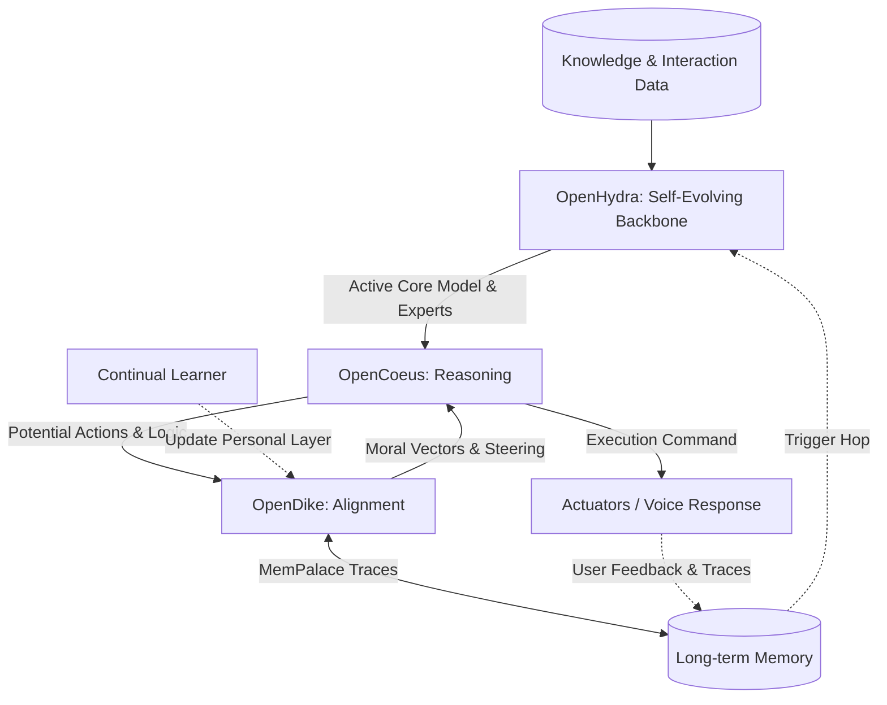

# Project Personality: The Neutron Binary Ecosystem

Welcome to the **Neutron Binary** organization page. We are building the foundational layers for **Conscious Digital Entities**—AI systems that don't just process data, but perceive, reason, and align with human values in real-time.

Our ecosystem is comprised of three core pillars that work in harmony to provide systems (from humanoid robots to smart home monitoring) a consistent, adaptive, and ethically-grounded **personality**.

---

## 🏗️ Core Pillars

### 👁️ [OpenHydra](https://github.com/Neutron-Binary-LLC/OpenHydra)
**The Self-Evolving AI Backbone**
Inspired by the biological hydra's regenerative capabilities, OpenHydra is a modular AI framework designed for recursive self-improvement and dynamic skill acquisition.
- **Dynamic Model Hopping**: Rapidly updates core intelligence by evaluating and merging specialized Semi-Core experts.
- **Semi-Core Specialization**: Captures task-specific nuances through parameter-efficient adapters (LoRA) tailored to interaction data.
- **Recursive Evolution**: Consolidates reasoning traces and memory from MemPalace into a unified, ever-improving perceptual state.

### 🧠 [OpenCoeus](https://github.com/Neutron-Binary-LLC/OpenCoeus)
**The Cognitive & Reasoning Engine**
Named after the Titan of Intellect, OpenCoeus provides the deep reasoning and self-reflective capabilities required for complex decision-making.
- **Continuous Reasoning**: Moves beyond static prompts to perpetual, multi-stage inference.
- **Self-Questioning Architecture**: An AI that interrogates its own assumptions before acting.
- **Reasoning Strategies**: Implements learned causal and assumption analysis to navigate ambiguous instructions.

### ⚖️ [OpenDike](https://github.com/Neutron-Binary-LLC/OpenDike)
**The Moral & Alignment Wrapper**
Representing the goddess of justice, OpenDike ensures every action and response is aligned with a multi-layered hierarchy of values.
- **Hierarchical Morality**: Composes "personality" from Country, Community, Organization, Demographic, and Personal layers.
- **MemPalace Memory**: Stores morally salient traces in a spatial, hierarchical structure for long-term consistency.
- **Continual Alignment**: Learns from user feedback to refine the personal layer while respecting global safety floors.

---

## 🤖 System Integration: How it Works

When deployed in a physical or digital system (e.g., a Home Assistant or a Robot), the three projects form a "Cognitive Loop":

---

## 🏠 Example Use Case: Smart Home Evolution

1. **Self-Evolution (OpenHydra)**: The system analyzes recent interactions in the home. It identifies that the user frequently asks about complex home maintenance. OpenHydra triggers a "hop," training a new Semi-Core expert on maintenance manuals to improve the system's specialized knowledge.
2. **Reasoning (OpenCoeus)**: When the user later asks, "How do I bleed the radiator?", Coeus uses the updated Core model provided by Hydra to reason through the multi-step technical process.
3. **Alignment (OpenDike)**: Dike ensures the instructions are delivered safely (e.g., adding warnings about hot water) by consulting the personal safety layer and organizational guidelines.
4. **Action**: The system provides a detailed, safe, and expert-level guide, learning from the user's successful completion of the task to further refine its future responses.

---

## 🌟 Our Vision
We believe that for AI to be truly integrated into human life, it must possess a **stable yet evolving personality**. By decoupling Perception (Hydra), Reasoning (Coeus), and Morality (Dike), we create systems that are transparent, steerable, and authentically aligned with their users.

---
© 2026 Neutron Binary LLC. Shaping the future of conscious digital entities.
